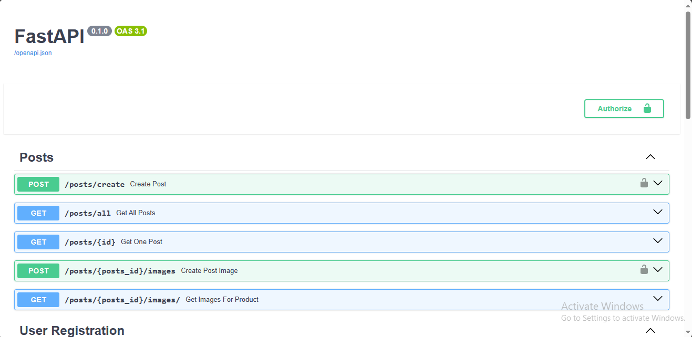

## Secure State APIs
> This Repository Represents The Backend Structure of a Project We are working on

### What's the Project about ?
> The Project represents a project that aims to curb Land Fraud

### Introduction
> Link to the Deployed Backend Database
> https://securestate-6cd6372a6cab.herokuapp.com/docs#/

### Dependencies
```text
alembic==1.12.1
annotated-types==0.6.0
anyio==3.7.1
asyncio==3.4.3
bcrypt==4.0.1
cffi==1.16.0
click==8.1.7
colorama==0.4.6
cryptography==41.0.5
dnspython==2.4.2
ecdsa==0.18.0
email-validator==2.1.0.post1
exceptiongroup==1.1.3
fastapi==0.104.1
greenlet==3.0.1
h11==0.14.0
httptools==0.6.1
idna==3.4
Mako==1.3.0
MarkupSafe==2.1.3
passlib==1.7.4
psycopg2==2.9.9
pyasn1==0.5.0
pycparser==2.21
pydantic==2.4.2
pydantic-settings==2.0.3
pydantic_core==2.10.1
python-dotenv==1.0.0
python-jose==3.3.0
python-multipart==0.0.6
PyYAML==6.0.1
rsa==4.9
six==1.16.0
sniffio==1.3.0
sql==2022.4.0
SQLAlchemy==2.0.23
starlette==0.27.0
typing_extensions==4.8.0
uvicorn==0.24.0.post1
watchfiles==0.21.0
websockets==12.0
```
### Installation
> Clone The repository
> 
> Install the necessary Dependencies



### Contributors
> All you have to do is Submit a pull request. Together we build

### BUGS
> No known Bugs as of now
